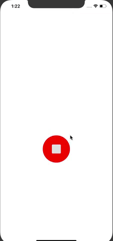
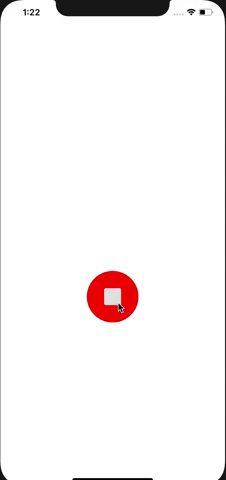
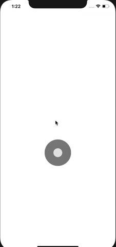
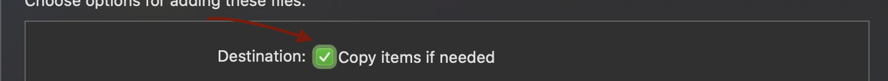

# SwiftyRecordButtons

> Light-wieght flashy Record button that can be easily added to any project

[![Swift Version][swift-image]][swift-url]
[![License][license-image]][license-url]
[![CocoaPods Compatible][cocoapods-image]][cocoapods-url]
![Platform][platform-image]
![PRs Welcome][pr-welcome-image]
[![Build Status][travis-image]][travis-url]


<p align = "center">





</p>


## Features

- [x] Burst animation upon click completion
- [x] Detection of click cancel for both states
- [ ] Play button
- [ ] Rewind & Forward buttons

## Requirements

- iOS 11.0+
- Xcode 10

## Installation

#### CocoaPods

You can use [CocoaPods](http://cocoapods.org/) to install `SwiftyRecordButtons` by adding it to your `Podfile`:

```ruby
use_frameworks!
pod 'SwiftyRecordButtons'
```

To get the full benefits import `SwiftyRecordButtons` wherever you import UIKit

```swift
import UIKit 
import SwiftyRecordButtons
```

#### Manually

1. Clone this repo and drop `SwiftyRecordButton.swift` in your project.
2. Make sure `Copy items if needed`  is checked
3. `cmd + B` to compile your project and make other swift files have access to `SwiftyRecordButton.swift` 
4. `let button = RecordButton()` in your desired .swift file
5. Congratulations!

## Usage example


#### Adding the button to the project 
```swift
import SwiftyRecordButtons

class YourViewController : UIViewController{
   
   let button = RecordButton()
   
   override func viewDidLoad() {
        super.viewDidLoad()
        view.addSubview(button)        
   }

}
```


#### RecordButton modfiable properties
```swift


   open var radius : CGFloat = 100 // Button Radius defaults to CGFloat 100
   open var isRecording : Bool = false // Button state will default to not recording
   open var iconViewColor : UIColor =  UIColor(white: 0.9, alpha: 1) // Color of the inside icon defaults to offwhite color

   open var isOnImage = UIImage(named: "stop") // Represents the image bursting away from the button when state switches to isRecording = true
   open var isOnColor : UIColor = .red // Button color when isRecording = true - defaults to red color
   open var isOnRange : Range<Float> = Range<Float>(uncheckedBounds: (lower: 30, upper: 80))  // The amount of images bursting away from the button for isRecording = true

   open var isOffImage = UIImage(named: "record") // Represents the image bursting away from the button when state switches to off
   open var isOffColor : UIColor = .gray // Button color when isRecording = false - defaults to gray color
   open var isOffRange: Range<Float> = Range<Float>(uncheckedBounds: (lower: 3, upper: 8)) // The amount of images bursting away from the button for isRecording = false
```

#### Example with modified properties

```swift
import SwiftyRecordButton

class YourViewController:UIViewController{
   
   let button = RecordButton()
   
   override func viewDidLoad(){
      super.viewDidLoad()
      view.addSubview(button)

      // Move the button to the center of the view

      button.translatesAutoresizingMaskIntoConstraints = false
      button.centerYAnchor.constraint(equalTo: view.centerYAnchor).isActive = true
      button.centerXAnchor.constraint(equalTo: view.centerXAnchor).isActive = true

      // Modify the button properties
      button.radius = 150
      button.isOnColor = .green
      button.isOffColor = .brow
      button.isOnRange = Range<Float>(uncheckedBounds: (lower: 5, upper: 40))
      button.isOffRange = Range<Float>(uncheckedBounds: (lower: 1, upper: 10))
   } 
}
```


## Contribute

We would love you for the contribution to **SwiftyRecordButtons**, check the `LICENSE` file for more info.

## Meta

Muhannad Alnemer – [@MhndMousa](https://twitter.com/mhndmousa)

Distributed under the MIT license. See [LICENSE](./LICENSE) for more information.


[swift-image]: https://img.shields.io/badge/swift-4.0-orange.svg
[swift-url]: https://swift.org/
[license-image]: https://img.shields.io/badge/License-MIT-blue.svg
[license-url]: LICENSE
[travis-image]: https://img.shields.io/travis/dbader/node-datadog-metrics/master.svg?style=flat-square
[travis-url]: https://travis-ci.org/dbader/node-datadog-metrics
[codebeat-image]: https://codebeat.co/badges/c19b47ea-2f9d-45df-8458-b2d952fe9dad
[codebeat-url]: https://codebeat.co/projects/github-com-vsouza-awesomeios-com
[platform-image]: https://img.shields.io/cocoapods/p/LFAlertController.svg?style=flat
[pr-welcome-image]:https://img.shields.io/badge/PRs-welcome-brightgreen.svg?style=flat-square
[cocoapods-image]:https://img.shields.io/cocoapods/v/SwiftyRecordButtons
[cocoapods-url]:https://img.shields.io/cocoapods/v/LFAlertController.svg
